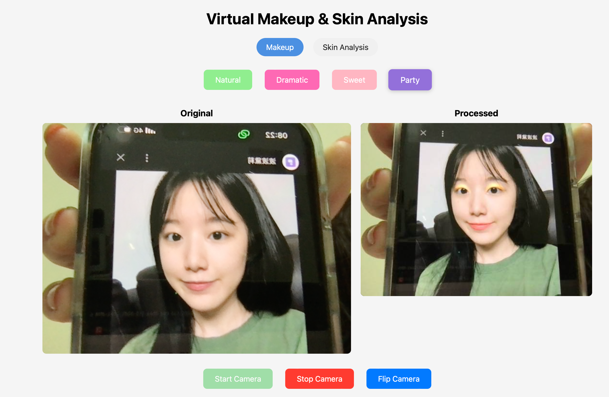
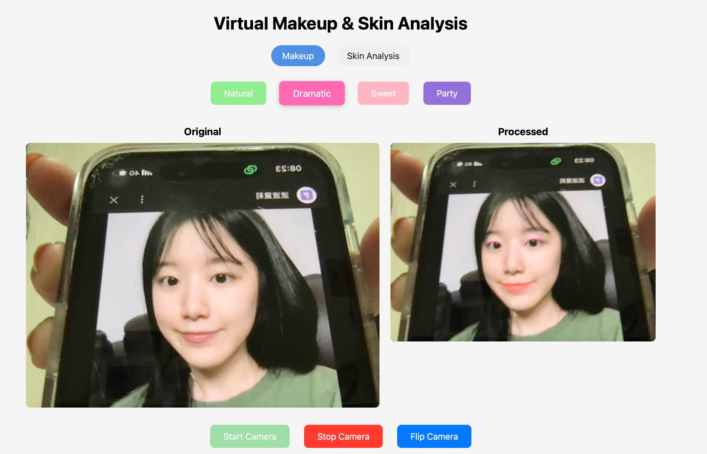
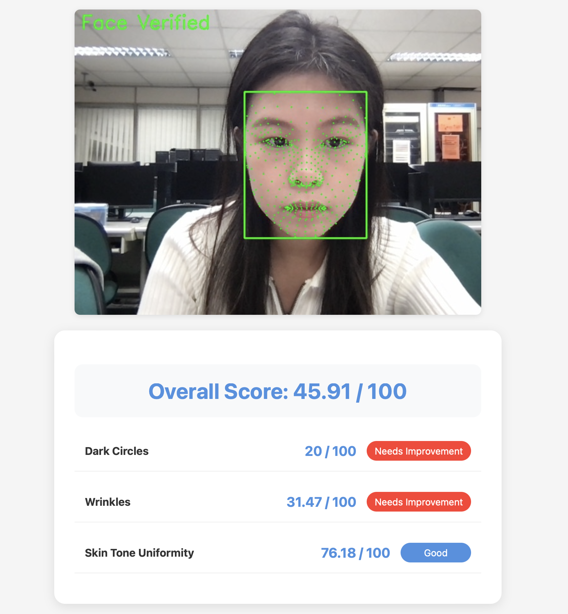
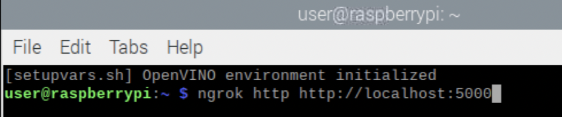
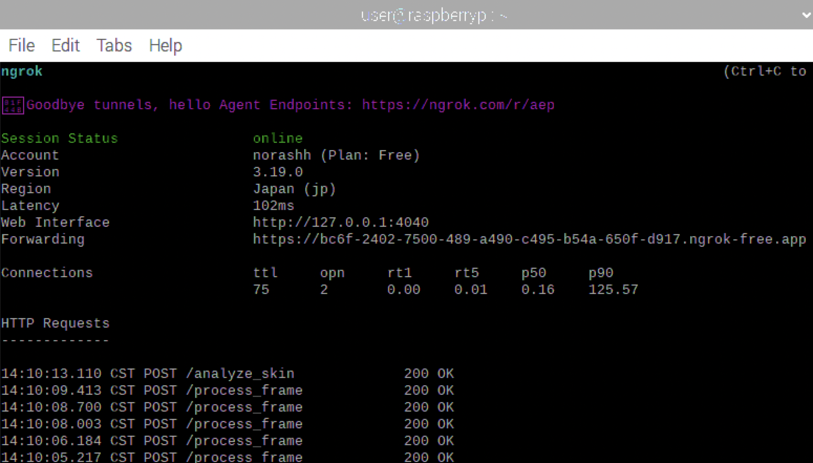

# Virtual Makeup Website with Skin Analysis

## Introduction
In this tutorial, we will guide you through building a Virtual Makeup Application using Python for backend processing. This application allows users to virtually apply makeup and analyze their skin in real-time using their device cameras. By following this step-by-step guide, you will learn to implement and run the project on a Raspberry Pi.

## Project Overview
- **Objective**: To create a virtual makeup application that leverages real-time video processing and OpenCV for makeup application.
- **Features**:
  - Real-time virtual makeup application.
  - Skin analysis using Mediapipe and custom logic.
- **Tools**:
  - Hardware: Raspberry Pi, MacBook (or other development devices).
  - Software: Python, OpenCV, Mediapipe, Numpy, Skinmage, Flask, Ngrok.

---

## Screenshots
- 
- 
- 
- 
- 
- 
- 

## Materials and Tools
### Hardware:
- Raspberry Pi (preferably 4B or later).
- Camera module or USB webcam.
- Power supply and HDMI monitor.
- Laptop (MacBook used for development).

### Software:
- Python (version 3.7 or later).
- OpenCV.
- Flask (for backend).
- Mediapipe.
- Numpy.
- Skinmage.
- Ngrok (for public access).

---

## System Architecture
### Diagram
```
+----------------+        +----------------+
| User's Camera  | ---->  | Frontend       |
+----------------+        +----------------+
        |                          |
        v                          v
+----------------+        +----------------+
| Backend Server | <----> | OpenCV + Mediapipe |
| (Python Flask) |        | Processing     |
+----------------+        +----------------+
```

---

## Step-by-Step Implementation

### 1. Setting Up the Environment
#### On the Raspberry Pi:
1. Install the latest Raspbian OS.
2. Update and upgrade the system:
   ```bash
   sudo apt update && sudo apt upgrade
   ```
3. Install Python and pip:
   ```bash
   sudo apt install python3 python3-pip
   ```
4. Install required libraries:
   ```bash
   pip3 install opencv-python flask mediapipe numpy skinmage
   ```
5. Clone the project repository:
   ```bash
   git clone <repository_url>
   cd virtual-makeup-project
   ```

#### On the MacBook (or any laptop):
1. Install Python and pip if not already installed.
2. Install dependencies as outlined above.

#### Setting Up Ngrok:
1. Download and install Ngrok from https://ngrok.com/.
2. Start Ngrok to expose the Flask server:
   ```bash
   ngrok http 5000
   ```

---

### 2. Setting Up the Backend
#### Flask Backend Code (Python):
```python
from flask import Flask, request, jsonify
import cv2
import numpy as np
from utils import read_landmarks, add_mask

app = Flask(__name__)

@app.route('/process', methods=['POST'])
def process_video():
    file = request.files['video']
    frame = cv2.imdecode(np.frombuffer(file.read(), np.uint8), cv2.IMREAD_COLOR)

    # Virtual makeup logic using utils.py
    landmarks = read_landmarks(frame)
    # Additional processing logic here

    return jsonify({"status": "processed", "result": "makeup_applied"})

if __name__ == '__main__':
    app.run(host='0.0.0.0', port=5000)
```

---

### 3. Developing the Frontend
#### HTML and JavaScript:
```html
<!DOCTYPE html>
<html lang="en">
<head>
    <meta charset="UTF-8">
    <title>Virtual Makeup App</title>
</head>
<body>
    <h1>Virtual Makeup Application</h1>
    <video id="video" autoplay></video>
    <canvas id="output"></canvas>

    <script>
        const video = document.getElementById('video');
        navigator.mediaDevices.getUserMedia({ video: true }).then((stream) => {
            video.srcObject = stream;
        });

        // Logic to capture frame and send to backend
    </script>
</body>
</html>
```

---

### 4. Testing and Debugging
- Run the backend server:
  ```bash
  python3 app.py
  ```
- Open the frontend in a browser and ensure the camera streams correctly.
- Use Ngrok to share the application:
  ```bash
  ngrok http 5000
  ```

---

## Additional Script: utils.py
```python
import numpy as np
import mediapipe as mp
import cv2

# landmarks of features from mediapipe
face_points={
"BLUSH_LEFT": [50],
"BLUSH_RIGHT": [280],
"LEFT_EYE": [33, 246, 161, 160, 159, 158, 157, 173, 133, 155, 154, 153, 145, 144, 163, 7, 33],
"RIGHT_EYE": [362, 298, 384, 385, 386, 387, 388, 466, 263, 249, 390, 373, 374, 380, 381, 382, 362],
"EYELINER_LEFT": [243, 112, 26, 22, 23, 24, 110, 25, 226, 130, 33, 7, 163, 144, 145, 153, 154, 155, 133, 243],
"EYELINER_RIGHT": [463, 362, 382, 381, 380, 374, 373, 390, 249, 263, 359, 446, 255, 339, 254, 253, 252, 256, 341, 463],
"EYESHADOW_LEFT": [226, 247, 30, 29, 27, 28, 56, 190, 243, 173, 157, 158, 159, 160, 161, 246, 33, 130, 226],
"EYESHADOW_RIGHT": [463, 414, 286, 258, 257, 259, 260, 467, 446, 359, 263, 466, 388, 387, 386, 385, 384, 398, 362, 463],
"FACE": [152, 148, 176, 149, 150, 136, 172, 58, 132, 93, 234, 127, 162, 21, 54, 103, 67, 109, 10, 338, 297, 332, 284, 251, 389, 454, 323, 401, 361, 435, 288, 397, 365, 379, 378, 400, 377, 152],
"LIP_UPPER": [61, 185, 40, 39, 37, 0, 267, 269, 270, 409, 291, 308, 415, 310, 312, 13, 82, 81, 80, 191, 78],
"LIP_LOWER": [61, 146, 91, 181, 84, 17, 314, 405, 321, 375, 291, 308, 324, 402, 317, 14, 87, 178, 88, 95, 78, 61],
"EYEBROW_LEFT": [55, 107, 66, 105, 63, 70, 46, 53, 52, 65, 55],
"EYEBROW_RIGHT": [285, 336, 296, 334, 293, 300, 276, 283, 295, 285]
}

# initialize mediapipe functions
mp_face_mesh = mp.solutions.face_mesh
mp_drawing = mp.solutions.drawing_utils

# to display image in cv2 window
def show_image(image: np.array, msg: str = "Loaded Image"):
    """
    image : image as np array
    msg : cv2 window name
    """
    image_copy = image.copy()
    cv2.imshow(msg, image_copy)
    cv2.waitKey(0)
    cv2.destroyAllWindows()

def read_landmarks(image: np.array):
    """
    image : image as np.array
    """
    landmark_cordinates = {}
    # load mediapipe facemesh and detect facial landmarks
    # face landmarks returns normalized points of all facial landmarks from 0 to 477
    with mp_face_mesh.FaceMesh(refine_landmarks=True) as face_mesh:
        results = face_mesh.process(image)
        face_landmarks = results.multi_face_landmarks[0].landmark

    # convert normalized points w.r.to image dimensions
    for idx, landmark in enumerate(face_landmarks):
        landmark_px = mp_drawing._normalized_to_pixel_coordinates(
            landmark.x, landmark.y, image.shape[1], image.shape[0]
        )
        # create a map of facial landmarks to (x,y) coordinates
        if landmark_px:
            landmark_cordinates[idx] = landmark_px
    return landmark_cordinates

# based on input facial features create make w.r.to colors
def add_mask(
    mask: np.array, idx_to_coordinates: dict, face_connections: list, colors: list
):
    """
    mask: image filled with 0's
    idx_to_coordinates : dict with (x,y) cordinates for each face landmarks
    face_connections : list of (x,y) cordinates for each facial features
    colors : list of [B,G,R] color for each features
    """
    for i, connection in enumerate(face_connections):
        # extract (x,y) w.r.to image for each cordinates
        points = np.array([idx_to_coordinates[idx] for idx in connection])
        # make a shape of feature in the mask and add color
        cv2.fillPoly(mask, [points], colors[i])

    # smoothening of image
    mask = cv2.GaussianBlur(mask, (7, 7), 4)
    return mask
```

---

## Conclusion
By following this tutorial, you should have a working Virtual Makeup Application running on a Raspberry Pi. Feel free to enhance the project by adding more features like facial recognition or more detailed skin analysis.

---

## Repository Link
[GitHub Repository](<repository_url>)

Ensure to clone the repository for the complete source code and additional assets.

