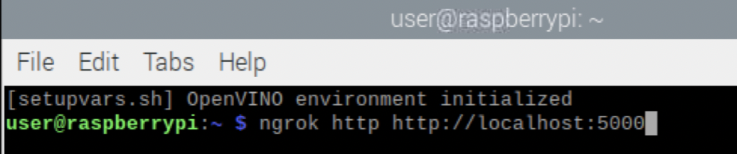
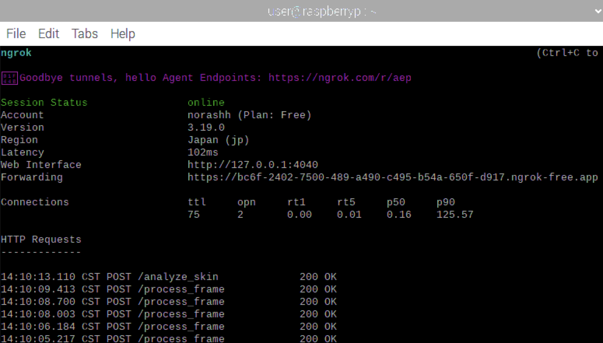
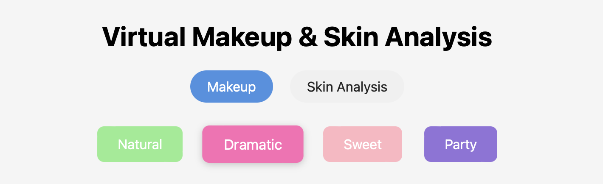
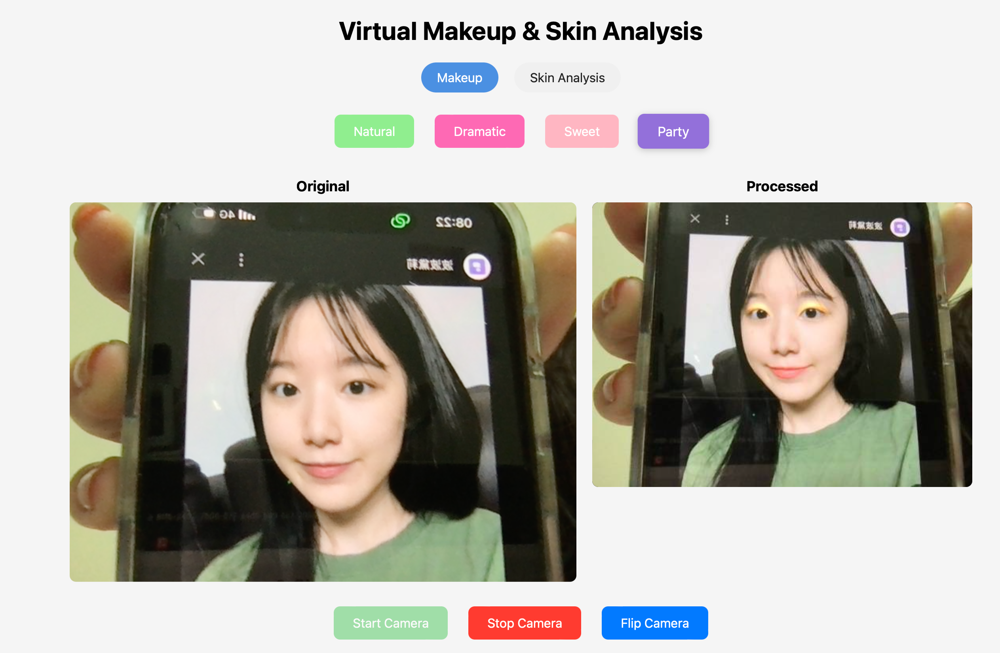
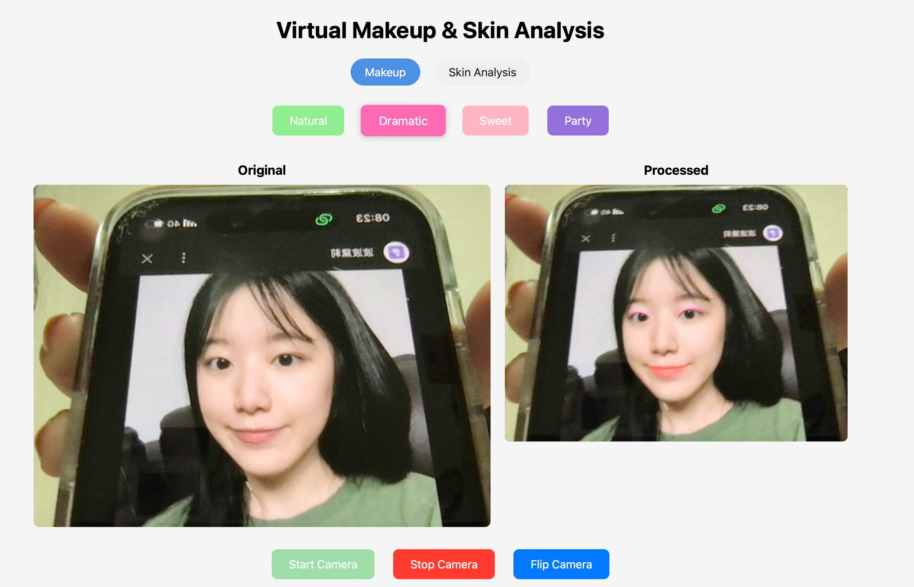
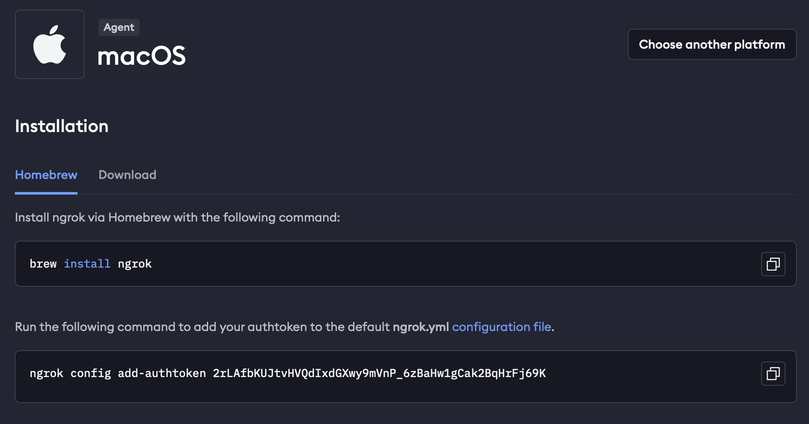

# Virtual Makeup Website with Skin Analysis

## Introduction
In this tutorial, we will guide you through building a Virtual Makeup Website using Python for backend processing. This application allows users to virtually apply makeup and analyze their skin in real-time using their device cameras. By following this step-by-step guide, you will learn to implement and run the project on a Raspberry Pi.

## Project Overview
- **Objective**: To create a virtual makeup application that leverages real-time video processing and OpenCV for makeup application.
- **Features**:
  - Real-time virtual makeup application.
  - Skin analysis using Mediapipe and custom logic.
- **Tools**:
  - Hardware: Raspberry Pi, MacBook (or other development devices).
  - Software: Python, OpenCV, Mediapipe, Numpy, Skinmage, Flask, Ngrok.

---

## Screenshots







## Features
- ***Real-Time Virtual Makeup Application***:

  The application allows users to try on makeup virtually in real-time using their build-in camera. The project applies makeup effects such as lip color, eyeshadow, eyeliner, and eyebrow styling to the user's face based on facial landmarks detected via the camera.
- ***Cross-Platform Access***:

  By using ngrok to expose the application, users can access the project from any device with an internet connection, even if they are not on the same network or domain. This feature ensures remote access to the application for testing or usage purposes.
- ***Customizable Makeup Styles***:

  Users can choose from different makeup styles, including Natural, Dramatic, Sweet, and Party. Each style is defined by a set of colors and opacity levels for various face elements (lips, eyes, eyebrows, etc.).
- ***Facial Landmark Detection***:

  Using MediaPipe Face Mesh, the application detects key facial landmarks (e.g., eyes, lips, cheeks) to accurately apply makeup to specific regions. The system uses a high-precision face mesh model to ensure that the makeup is aligned with the user's facial features.
- ***Face Validation***:

  The system validates if a face is properly detected, checking for conditions like face size, position, and aspect ratio. If the face is not in a valid position or is too small, users will receive feedback and a debug image for troubleshooting.
- ***Skin Analysis***:

  The system performs analysis of the user's skin to assess:
  - **Dark Circles**: Using color analysis in the LAB color space to measure the darkness under the eyes.
  - **Wrinkles**: Using multi-scale edge detection techniques to identify wrinkles in the forehead and around the eyes.
  - **Skin Tone Uniformity**: Analyzing color variations on the cheeks and forehead to determine the uniformity of the skin tone. 

## Materials and Tools
### Hardware:
- Raspberry Pi (preferably 4B or later).
- Any device equipped with a camera and capable of connecting to the internet

### Software:
- Python 3.7
- OpenCV
- Flask (for backend)
- Mediapipe
- Numpy
- Skinmage
- Ngrok (for public access)

---

## System Architecture
### Diagram
```
+----------------+        +----------------+
| User's Camera  | ---->  | Frontend       |
+----------------+        +----------------+
        |                          |
        v                          v
+----------------+        +----------------+
| Backend Server | <----> | OpenCV + Mediapipe |
| (Python Flask) |        | Processing     |
+----------------+        +----------------+
```

---

## Step-by-Step Implementation

### 1. Setting Up the Environment
#### On the Raspberry Pi:
1. Install the latest Raspbian OS.
2. Update and upgrade the system:
   ```bash
   sudo apt update && sudo apt upgrade
   ```
3. Install Python and pip:
   ```bash
   sudo apt install python3.7 python3-pip
   ```
4. Install required libraries:
   ```bash
   pip3 install opencv-python flask mediapipe numpy scikit-image
   ```
5. Clone the project repository:
   ```bash
   git clone https://github.com/Noora66612/VirtualMakeup_n_SkinAnalysis_using_rpi.git
   cd virtual-makeup-project
   ```

#### Setting Up Ngrok:
1. Sigh up and install Ngrok from https://ngrok.com/.

   - use a MacBook as an example
   
3. Start Ngrok to expose the Flask server:
   ```bash
   ngrok http http://localhost:5000
   ```

---

### 2. Setting Up the Backend
#### Flask Backend Code (Python):
```python
from flask import Flask, request, jsonify
import cv2
import numpy as np
from utils import read_landmarks, add_mask

app = Flask(__name__)

@app.route('/process', methods=['POST'])
def process_video():
    file = request.files['video']
    frame = cv2.imdecode(np.frombuffer(file.read(), np.uint8), cv2.IMREAD_COLOR)

    # Virtual makeup logic using utils.py
    landmarks = read_landmarks(frame)
    # Additional processing logic here

    return jsonify({"status": "processed", "result": "makeup_applied"})

if __name__ == '__main__':
    app.run(host='0.0.0.0', port=5000)
```

---

### 3. Developing the Frontend
#### HTML and JavaScript:
```html
<!DOCTYPE html>
<html lang="en">
<head>
    <meta charset="UTF-8">
    <title>Virtual Makeup App</title>
</head>
<body>
    <h1>Virtual Makeup Application</h1>
    <video id="video" autoplay></video>
    <canvas id="output"></canvas>

    <script>
        const video = document.getElementById('video');
        navigator.mediaDevices.getUserMedia({ video: true }).then((stream) => {
            video.srcObject = stream;
        });

        // Logic to capture frame and send to backend
    </script>
</body>
</html>
```

---

### 4. Testing and Debugging
- Run the backend server on the Raspberry Pi terminal:
  ```bash
  python3 app.py
  ```
- Use Ngrok to share the application (in another terminal window on the Raspberry Pi):
  ```bash
  ngrok http http://localhost:5000
  ```
- Paste the URL into the browser on your device and ensure the camera streams correctly.
---

## Demo Video
- https://youtu.be/5BYBEP4fRqY
- :warning: The file name shown in the video is app3.py, but it has been corrected to app.py. Please use app.py in your setup.

---

## Areas for Improvement and Suggestions
- ***Video Latency***
  - Issue: The application exhibits noticeable video latency during real-time processing, particularly on low-performance devices such as the Raspberry Pi.
  - Suggestions for Improvement: Optimize Video Processing: Utilize techniques like hardware acceleration (e.g., leveraging WebGL or GPU processing) to reduce the computational load.
Adjust Resolution: Allow users to select lower video resolutions to decrease processing time.
Asynchronous Processing: Introduce asynchronous or multithreaded processing to improve the responsiveness of the application.

- ***Unrealistic Skin Analysis Scores***
  - Issue: The skin analysis scores provided by the application sometimes do not align with real-world conditions, leading to user dissatisfaction.

---

## Conclusion
By following this tutorial, you should have a working Virtual Makeup Application running on a Raspberry Pi. Feel free to enhance the project by adding more features like facial recognition or more detailed skin analysis.

---

## References


